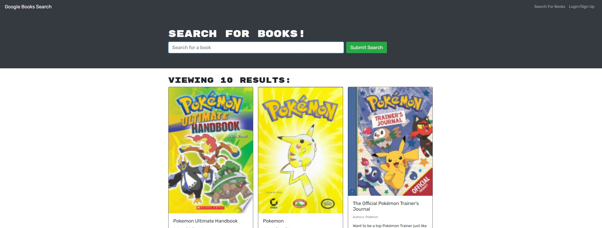

# 21 My MERN: Book Search Engine



## Links
- [HEROKU deployment](https://googlebooks-search-mern-app.herokuapp.com/)
- [GitHub Repo](https://github.com/MiinoSil/22-HW-MERN-GOOGLE-BOOK-SEARCH-GIT)

## Table of Contents
1. [Description](#description)
2. [User Story](#user-story)
3. [NPM Requirements](#npm-requirements)
4. [Credits](#credits)
5. [License](#license)
## Description

A MERN stack app built with REACT, MongoDB, Node.js, Express.js. The USER can create an account, sign in and save search book information to their profile. USER can also access via GraphQL to make changes to the mongoDB. 

## User Story

```md
AS AN avid reader
I WANT to search for new books to read
SO THAT I can keep a list of books to purchase
```

## NPM requirements
1. Apollo Client and Server
2. Express.js
3. mongodb and mongoose
4. React

## Usage
1. install dependencies
2. ```npm run develop``` to run server and client concurrently

## Credits

- Andrew Ngo
    - [Github Profile](https://github.com/MiinoSil)

## License

[](https://opensource.org/licenses/MIT)